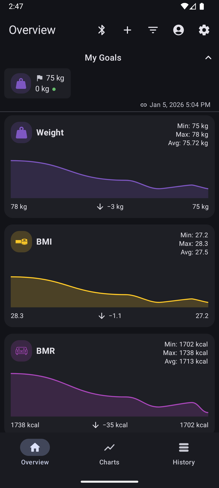
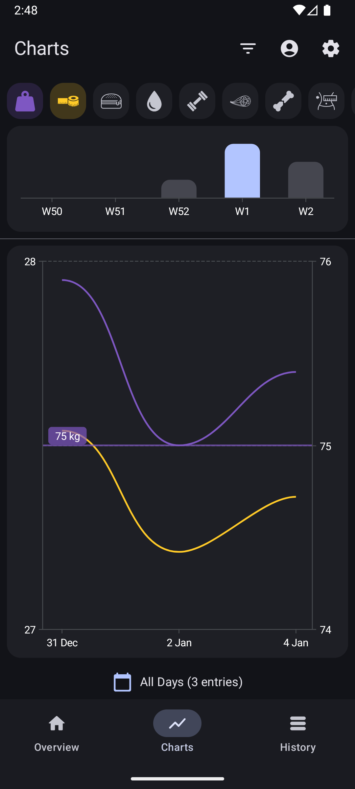
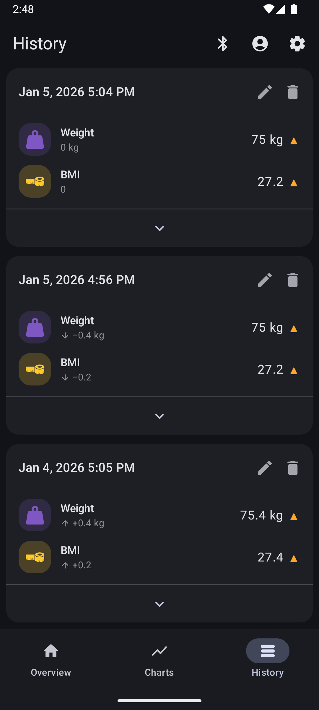

#  openScale Redesigned
Fork of [openScale](https://github.com/oliexdev/openScale)

A simple, privacy-focused weight tracker for Android, with support for various Bluetooth scales.

## Changes in this Fork ✨
- 📱 **Navigation:** Switched from Navigation Drawer to a Bottom Navigation Bar.
- 🎨 **Material Design:** Updated the UI to be more in line with Material Design standards.

# Screenshots :eyes:

<table>
  <tr>
    <th>
        
    </th>
    <th>
        
    </th>
    <th>
        
    </th>
  </tr>
</table>

## License :page_facing_up:

openScale is licensed under the GPL v3, see LICENSE file for full notice.

    Copyright (C) 2025  olie.xdev <olie.xdeveloper@googlemail.com>
    Copyright (C) 2026  fynn.sb <dev@fynn.sb>
    
    This program is free software: you can redistribute it and/or modify
    it under the terms of the GNU General Public License as published by
    the Free Software Foundation, either version 3 of the License, or
    (at your option) any later version.

    This program is distributed in the hope that it will be useful,
    but WITHOUT ANY WARRANTY; without even the implied warranty of
    MERCHANTABILITY or FITNESS FOR A PARTICULAR PURPOSE.  See the
    GNU General Public License for more details.

    You should have received a copy of the GNU General Public License
    along with this program.  If not, see <http://www.gnu.org/licenses/>
